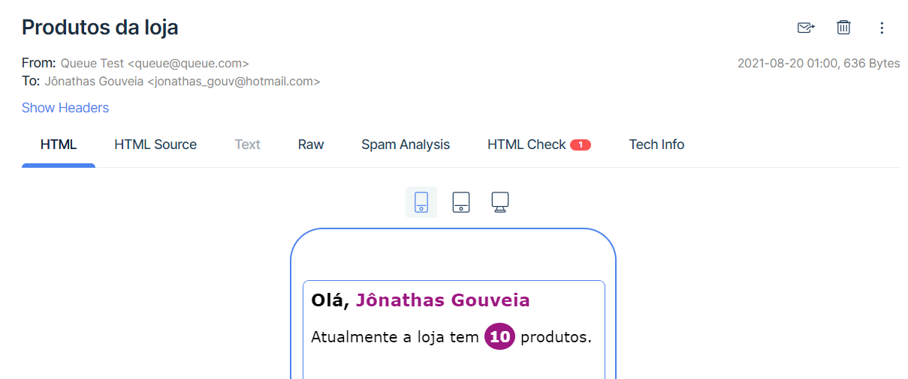

# Teste Back End - NodeJS
**Codeby**

Projeto criado para o desafio de backend da Codeby. Como não estava especificado como o codigo deveria funcionar, se ele deveria ser executado periodicamente, etc. eu decidi criá-lo como uma REST API.

<p align="center">
  
</p>

## Conteúdos
* [Começando](#começando)
* [Instalação](#instalação)
* [Modo de usar](#modo-de-usar)
* [Construído Com](#construído-com)
* [Autor](#autor)

##  Começando
Essas instruções fornecerão uma cópia do projeto instalado e funcionando em sua máquina local para fins de desenvolvimento e teste.

## Instalação
Execute os comandos a seguir e você terá uma versão local do projeto em execução.
```bash
$ git clone https://github.com/jonathasgouv/teste-codeby.git
$ cd teste-codeby/
$ npm install
```
Renomeie o arquivo `.env.example` para `.env` e preencha as variáveis de ambiente. Pronto, agora basta iniciar o server de desenvolvimento com:

```bash
$ npm run dev
```

:grinning:

## Modo de usar
Basta enviar uma requisição post para o endpoint `/api/mail` com as variáveis `name` e `email` no corpo.

Por exemplo:
```bash
curl --request POST \
  --url http://localhost:3333/api/mail \
  --header 'Content-Type: application/json' \
  --data '{
	"name": "Jônathas Gouveia",
	"email": "jonathas_gouv@hotmail.com"
}'
```

## Construído Com
* [Javascript](https://www.javascript.com/)
* [Node.js](https://nodejs.org/en/)
* [Express](https://expressjs.com/)
* [Bull](https://github.com/OptimalBits/bull)
* [Redis](https://redis.io/)

## Autor
* [Jônathas Gouveia](https://github.com/jonathasgouv/)